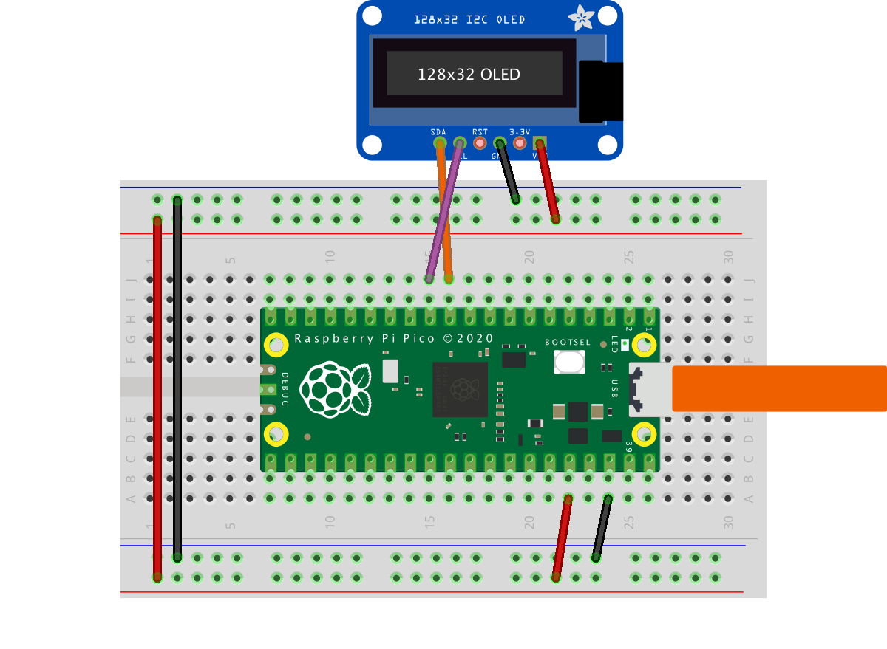

= Using a SH1106-based OLED graphics display
:xrefstyle: short

Display an image and text on I2C driven SH1106-based OLED graphics display 
such as the Pimoroni Breakout Garden 1.12" Mono OLED https://shop.pimoroni.com/products/1-12-oled-breakout?variant=29421050757203 
.

== Wiring information

See <<oled-wiring-diagram>> for wiring instructions.

[[oled-wiring-diagram]]
[pdfwidth=75%]
.Wiring the OLED to Pico using I2C

== List of Files

A list of files with descriptions of their function;

i2c_1106oled_using_defaults.py:: The example code.
i2c_1106oled_with_freq.py:: The example code, explicitly sets a frequency.
sh1106.py:: SH1106 Driver Obtained from https://github.com/robert-hh/SH1106

== Bill of Materials

.A list of materials required for the example
[[oled-bom-table]]
[cols=3]
|===
| *Item* | *Quantity* | Details
| Breadboard | 1 | generic part
| Raspberry Pi Pico | 1 | http://raspberrypi.org/
| Monochrome 128x128 I2C OLED Display | 1 | https://shop.pimoroni.com/products/1-12-oled-breakout?variant=29421050757203
|===
