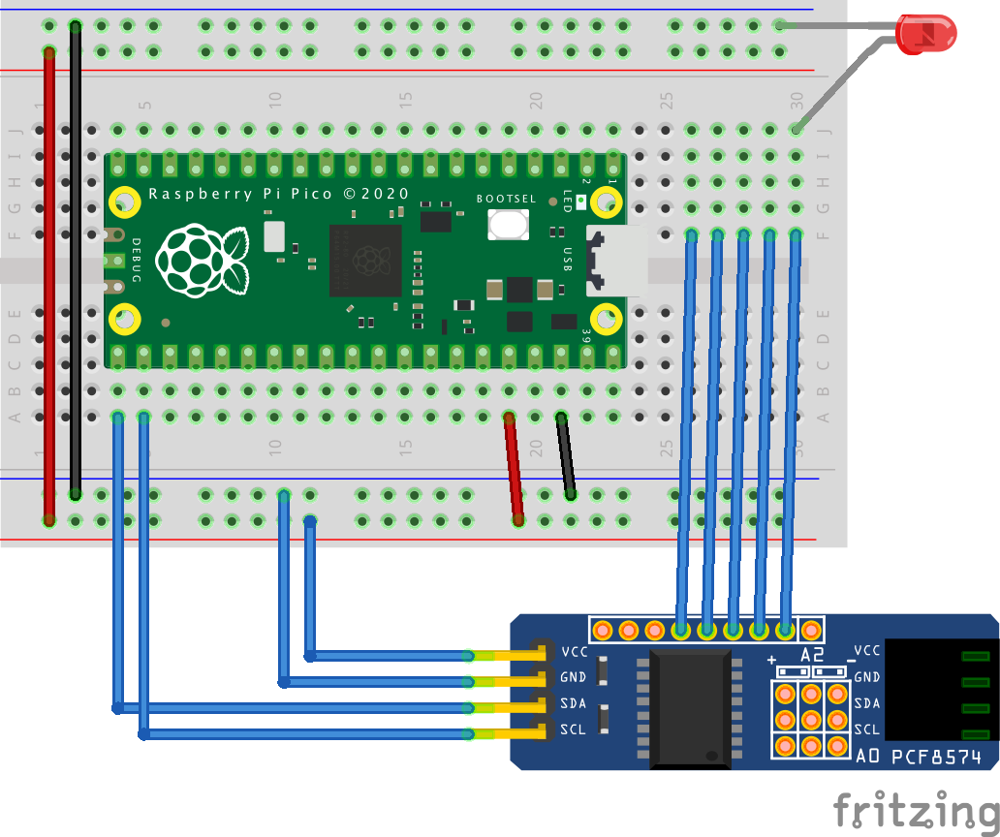

= Using a PCF8574 remote 8-Bit I/O expander over I2C to get more IO pins
:xrefstyle: short

This example demonstrates how to use the PCF8574 Remote 8-Bit I/O Expander with the Raspberry Pi Pico over the I2C bus. The code toggles the pins of the PCF8574 sequentially, turning them on and off one by one.

== Wiring information

See <<pcf8574-wiring-diagram>> for wiring instructions.

[[pcf8574-wiring-diagram]]
[pdfwidth=75%]
.Wiring the PCF8574 to Pico using I2C

== List of Files

A list of files with descriptions of their function;

i2c_pcf8574_blink.py:: The example code.
i2c_get_address.py:: Some code to detect the I2C address of the expander board.

== Bill of Materials

.A list of materials required for the example
[[pcf8574-bom-table]]
[cols=3]
|===
| *Item* | *Quantity* | Details
| Breadboard | 1 | generic part
| Raspberry Pi Pico | 1 | https://www.raspberrypi.com/products/raspberry-pi-pico/
| PCF8574 I/O expander board | 1 | 
| LEDs or other things to control | 8 | 
|===
