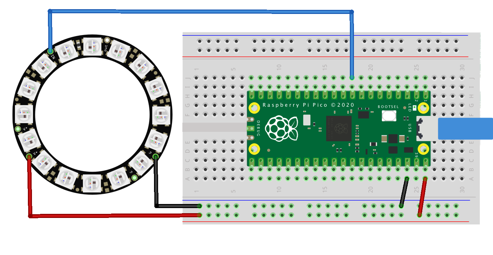

= Using PIO to drive a set of NeoPixel Ring (WS2812 LEDs)
:xrefstyle: short

Combination of the PIO WS2812 demo with the Adafruit 'essential' NeoPixel example code to show off color fills, chases and of course a rainbow swirl on a 16-LED ring.

== Wiring information

See <<neopixel-wiring-diagram>> for wiring instructions.

[[neopixel-wiring-diagram]]
[pdfwidth=75%]
.Wiring the 16-LED NeoPixel Ring to Pico 

== List of Files

A list of files with descriptions of their function;

neopixel_ring.py:: The example code.

== Bill of Materials

.A list of materials required for the example
[[ring-bom-table]]
[cols=3]
|===
| *Item* | *Quantity* | Details
| Breadboard | 1 | generic part
| Raspberry Pi Pico | 1 | http://raspberrypi.org/
| NeoPixel Ring | 1 | https://www.adafruit.com/product/1463
|===
