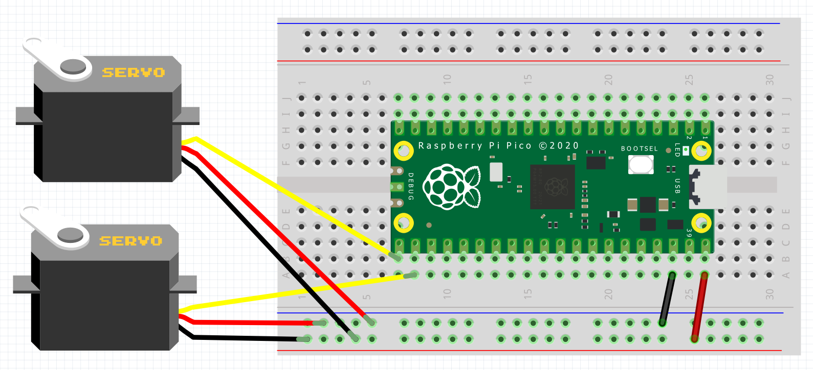

= Using PIO to drive a servo motor
:xrefstyle: short

Drive a servo motor by using two PIO statemachines for pulse output.

Each output needs a statemachine running servo_trigger and one running servo_prog.
Due to the IRQ assignments, the statemachines need to be in ordered to have the servo_trigger program first, e.g.:

```
trig = Servo_Trigger(0)                 # Statemachine 0
s = Servo(1, 16) # phys IO on pin 16    # Statemachine 1, since the trigger is on SM0

trig2 = Servo_Trigger(2)                # Statemachine 2
s2 = Servo(3, 25) # Builtin LED         # Statemachine 3, since the trigger is on SM2
```

== Wiring information

See <<servo-wiring-diagram>> for wiring instructions.

[[servo-wiring-diagram]]
[pdfwidth=75%]
.Wiring the servo to Pico


== List of Files

A list of files with descriptions of their function;

pio_servo.py:: The example code, driving one servo

== Bill of Materials

.A list of materials required for the example
[[ring-bom-table]]
[cols=3]
|===
| *Item* | *Quantity* | Details
| Breadboard | 1 | generic part
| Raspberry Pi Pico | 1 | http://raspberrypi.org/
| Servo | 1 | generic part
|===
