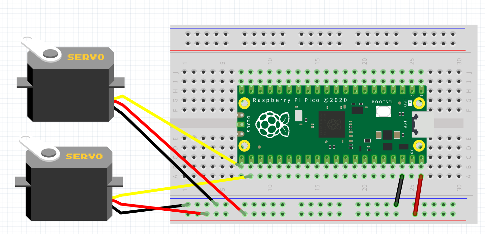

= Using PIO to drive a servo motor
:xrefstyle: short

Drive a servo motor by using two PIO statemachines for pulse output.

== Wiring information

See <<servo-wiring-diagram>> for wiring instructions.

[[servo-wiring-diagram]]
[pdfwidth=75%]
.Wiring the servo to Pico

== List of Files

A list of files with descriptions of their function;

pio_servo.py:: The example code, driving one servo

== Bill of Materials

.A list of materials required for the example
[[ring-bom-table]]
[cols=3]
|===
| *Item* | *Quantity* | Details
| Breadboard | 1 | generic part
| Raspberry Pi Pico | 1 | http://raspberrypi.org/
| Servo | 1 | generic part
|===
