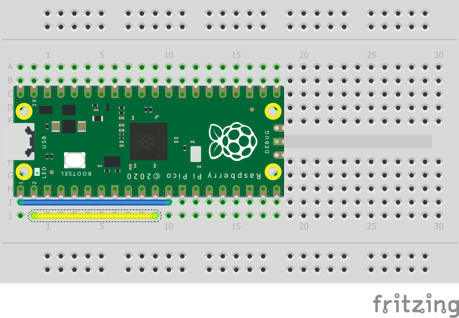

= Using UART on the Raspberry Pi Pico
:xrefstyle: short

Send data from the UART1 port to the UART0 port. Other things to try;

[source,python]
----
uart0 = UART(0)
----

which will open a UART connection at the default baudrate of 115200, and

[source,python]
----
uart0.readline()
----

which will read until the CR (\r) and NL (\n) characters, then return the line.

== Wiring information

See <<uart-wiring-diagram>> for wiring instructions.

[[uart-wiring-diagram]]
[pdfwidth=75%]
.Wiring two of the Pico's ports together. Be sure to wire UART0 TX to UART1 RX and UART0 RX to UART1 TX.

== List of Files

A list of files with descriptions of their function;

uart.py:: The example code.

== Bill of Materials

.A list of materials required for the example
[[uart-bom-table]]
[cols=3]
|===
| *Item* | *Quantity* | Details
| Breadboard | 1 | generic part
| Raspberry Pi Pico | 1 | https://www.raspberrypi.com/products/raspberry-pi-pico/
|===
